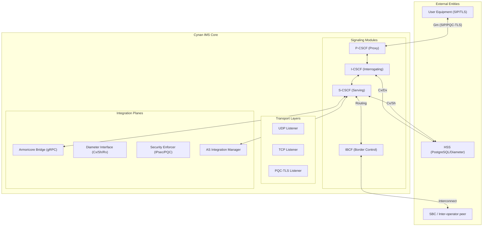

# 🦅 Cynan IMS Core

[]()
[]()
[](https://www.rust-lang.org/)
[]()

**The Next-Generation, Post-Quantum Secure IMS Core for Modern Telecommunications.**

---

> [!WARNING]
> **DEVELOPMENT SOFTWARE - NOT FOR PRODUCTION USE**
> This implementation is currently under active development and has not been production-hardened. Comprehensive security audits, performance validation, and regulatory compliance testing are required before any production deployment.


## 💎 Why Cynan? 

While standard IMS solutions from industry incumbents are built on decades-old legacy codebases, Cynan offers a **Quantum-Ready, Memory-Safe** alternative designed for the future:

*   **🛡️ Quantum-Safe Today**: Our mission is to secure the digital future. Cynan implements NIST-standardized Post-Quantum Cryptography (**ML-KEM, ML-DSA**) natively, ensuring your data remains private and secure against future threats.
*   **🦀 100% Memory Safety**: Built in **Rust** with zero `unsafe` blocks. This means simplicity and reliability for your engineering teams, eliminating the buffer overflows and data races that plague legacy C++ signaling cores.
*   **🌐 Zero-Trust Architecture**: We empower organizations to manage and share data effectively. Every internal signaling jump between modules is signed and validated—protecting the people behind the devices.
*   **⚡ Lightweight Agility**: A cloud-native microservice architecture designed for efficiency. Achieve carrier-grade throughput (1000+ CPS) with fewer resources, reducing operational complexity and infrastructure costs.

---

## 📞 Supported Voice Services
Cynan IMS Core is designed to be the signaling heart for a wide range of modern telecommunications services:

- **Voice over LTE (VoLTE)**: Seamlessly bridges voice services over 4G/LTE networks using standard 3GPP functional elements.
- **Voice over New Radio (VoNR)**: Full support for 5G voice services through optimized signaling and low-latency transport.
- **Voice over WiFi (VoWiFi)**: Enhances coverage and reliability by facilitating secure calls over non-3GPP access networks.
- **Voice over Broadband (VoBB)**: Flexible voice services delivered over fixed broadband connections for residential and enterprise users.

---

## 🏗️ Architecture Overview

Cynan implements the full 3GPP IMS architecture, providing seamless control and orchestration for SIP-based multimedia services.



---

## ⚡ Key Technical Features

### �️ Post-Quantum Security (NIST Standards)
*   **Zero Trust Architecture**: Every interconnect is signed and validated.
*   **Hybrid PQC-TLS**: ML-KEM-768 for quantum-safe key exchange with ECDHE fallback.
*   **Eagle-Fast Auth**: Falcon-512 signatures providing high-throughput SIP authentication.
*   **Inter-Operator PQC**: ML-DSA signatures for IBCF peer validation.

### 🚀 Performance & Scalability
*   **Async-First**: Powered by the Tokio runtime for 1000+ CPS on commodity hardware.
*   **Memory Safety**: 100% Rust memory safety (Zero `unsafe` blocks).
*   **Modular Design**: Hot-swappable functional modules based on standardized Rust traits.

### 🎥 Integration & Media
*   **Armoricore Bridge**: Native gRPC/TLS interface for secure media orchestration.
*   **IPsec XFRM**: Native Linux kernel integration for Gm interface security.
*   **Diameter Pipeline**: Comprehensive Cx, Sh, and Rx interfaces for HSS connectivity.

---

## 📊 Implementation Status (v0.8.0)

| Category | Component | Status | Description |
| :--- | :--- | :--- | :--- |
| **Core** | Transport Layer | ✅ | UDP, TCP, and PQC-enabled TLS 1.3 listeners. |
| | IMS Modules | ✅ | P-CSCF, I-CSCF, S-CSCF, BGCF, MGCF, IBCF, SLF. |
| **Security** | PQC primitives | ✅ | NIST Level 3 safety with ML-KEM, ML-DSA, Falcon. |
| | IPsec (Gm) | ✅ | Native Linux XFRM integration (RFC 3329). |
| **Integration** | Diameter | ✅ | Full Cx, Sh, and Rx interface implementations. |
| | Armoricore | ✅ | Secure gRPC bridge for media engine control. |
| | Media Plane | ✅ | RTP Parsing complete; Routing logic active via gRPC bridge. |

---

## 📚 Documentation & Guides

Explore our detailed technical artifacts for deep dives into Cynan's internals:

*   � **[PQC Architecture](docs/PQC_ARCHITECTURE.md)** - The core theory and implementation of quantum security.
*   🟢 **[SBC Connectivity](docs/SBC_CONNECTIVITY_GUIDE.md)** - Guide for integrating external networks and SBCs.
*   🚀 **[Migration Guide](docs/PQC_MIGRATION_GUIDE.md)** - Step-by-step PQC adoption path.
*   🛠️ **[Troubleshooting](docs/PQC_TROUBLESHOOTING.md)** - Operational guide for common scenarios.
*   🔍 **[Security Audit](docs/pqc_security_audit.md)** - Current security evaluations and threat model.
*   📈 **[Performance Analysis](docs/PQC_PERFORMANCE_ANALYSIS.md)** - Algorithm benchmarking and efficiency results.
*   🛡️ **[Supply Chain Integrity](SUPPLY_CHAIN_INTEGRITY.md)** - Cryptographic manifest and digital watermark verification.

---

## � System Requirements

Cynan is engineered for high-performance execution on modern hardware. For carrier-grade production deployments (1000+ CPS), we recommend the following:

### Hardware Requirements
*   **CPU**: 2+ Core modern x86_64 or ARM64 (AVX2/AES-NI recommended for high-performance PQC).
*   **RAM**: 4GB Minimum (8GB+ recommended for large subscriber location caches).
*   **Storage**: 10GB Available space (primarily for logs and HSS database).
*   **Network**: 1Gbps Ethernet minimum; 10Gbps recommended for IBCF interconnects.

### Software Requirements
*   **Operating System**: Linux (Kernel 5.15+ required for native IPsec XFRM support).
*   **Database**: PostgreSQL 15.0+ (HSS/Subscriber storage).
*   **Dependencies**: `libssl-dev`, `pkg-config` (for Rust cryptographic bindings).

---

## 🚀 Getting Started

### Prerequisites
*   **Rust Toolchain**: 1.75+

### Automated Installation (Recommended for Servers)

For a professional, automated deployment on **Ubuntu, Debian, or RHEL**, run our official installation script as root:

```bash
chmod +x scripts/install.sh
sudo ./scripts/install.sh
```

This script will:
1.  Detect your OS and install all required system dependencies.
2.  Install the Rust toolchain if not present.
3.  Build the production-optimized `cynan` binary.
4.  Configure `/etc/cynan` and `/var/log/cynan` system directories.
5.  Install and enable the `cynan.service` in **systemd** for carrier-grade persistence.

---

### Post-Installation Setup

After the installation script completes, perform the following two steps to prepare the system for operation:

#### 1. Initialize PostgreSQL HSS Database
Create the database and user as defined in `/etc/cynan/cynan.yaml`:

```bash
# Switch to the postgres user
sudo -u postgres psql

# Create the user and database (adjust names/passwords as needed)
CREATE USER cynan WITH PASSWORD 'change_me';
CREATE DATABASE cynan_hss OWNER cynan;
\q

# Apply migrations
sqlx migrate run
```

#### 2. Configure TLS Certificates
Place your carrier-grade or development certificates in the designated security directory:
*   **Path**: `/etc/cynan/certs/`
*   **Required Files**: `core.crt` and `core.key` (or as specified in `cynan.yaml`).

#### 3. Start the Service
Once configured, start the Cynan IMS Core:

```bash
sudo systemctl start cynan
sudo systemctl status cynan
```

---

### Manual Build

## 🤝 Acknowledgments

Cynan IMS Core is built upon a foundation of high-quality open-source and professional-grade libraries. We gratefully acknowledge the following projects:

### 🔐 Cryptography & Security
- **[fips203](https://crates.io/crates/fips203)**, **[fips204](https://crates.io/crates/fips204)**, **[fn-dsa](https://crates.io/crates/fn-dsa)**: NIST PQC implementations.
- **[aws-lc-rs](https://crates.io/crates/aws-lc-rs)**: FIPS-validated cryptographic provider.
- **[rustls](https://github.com/rustls/rustls)**: Memory-safe TLS.

### 🚀 Infrastructure & Protocols
- **[tokio](https://tokio.rs/)**: High-performance async runtime.
- **[tonic](https://github.com/hyperium/tonic)**: Robust gRPC stack.
- **[sqlx](https://github.com/launchbadge/sqlx)**: Type-safe database connection pooling.
- **[rsip](https://github.com/v0lley/rsip)**: Comprehensive SIP protocol engine.

---

## 📜 License

Copyright © 2026 **Fastcomcorp, LLC**. All rights reserved.

This software is **dual-licensed**:

| Feature | Community Edition | Commercial Edition |
| :--- | :--- | :--- |
| **License** | Apache 2.0 | Proprietary |
| **Usage** | Personal / Educational | Commercial / Production |
| **Support** | Community-based | **Customized Enterprise Support** |
| **SLA & Uptime** | Best-effort | **Production SLAs Available** |
| **Legal** | As-is / No Warranty | **Full Indemnification** |
| **Compliance** | Community-led | **Carrier & Regulatory Assistance** |
| **Updates** | Public Release | **Early Access & Priority Fixes** |

1.  **Apache License, Version 2.0**: For non-commercial, personal, and educational use.
2.  **Commercial License**: Required for all commercial use, distribution, or revenue-generating deployment. Each commercial agreement is tailored to provide the specific **Enterprise Support**, SLAs, and legal protections required for mission-critical telecommunications.

See the [LICENSE](LICENSE) file for the full legal text. For inquiries regarding customized commercial terms, or to learn how Fastcomcorp can partner with your organization to unlock the power of people-centered technology, contact **licensing@fastcomcorp.com**.
