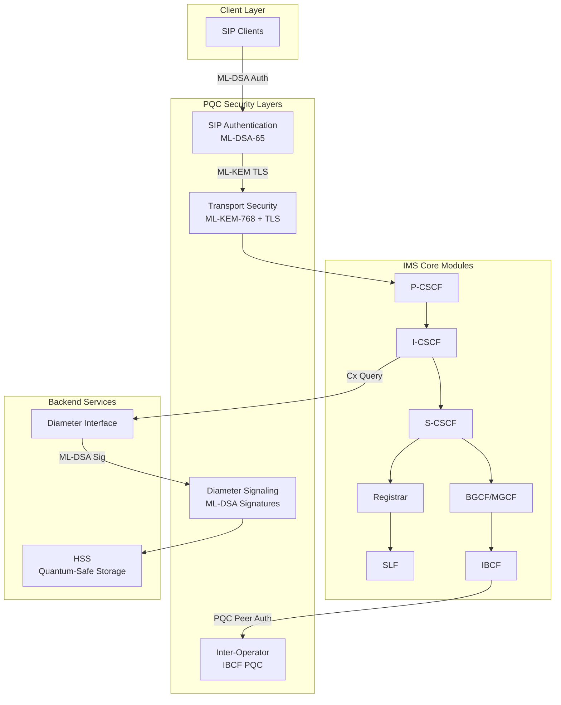
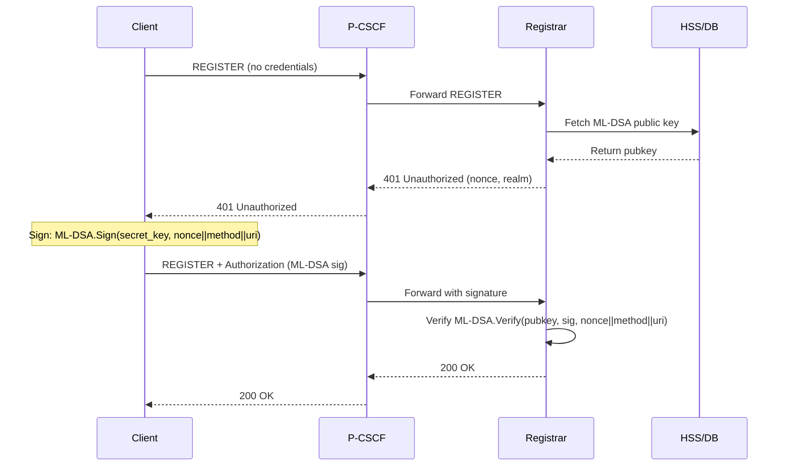

# Cynan IMS Core - Post-Quantum Cryptography Architecture

## Executive Summary

This document provides a comprehensive technical overview of the Post-Quantum Cryptography (PQC) integration into the Cynan IMS (IP Multimedia Subsystem) Core. This implementation represents a complete security overhaul of telecommunications infrastructure to defend against quantum computing threats, utilizing NIST-standardized algorithms (FIPS 203, 204, 205).

**Status**: Phases 1-11 Complete (All phases) - Production-Ready Core Implementation  
**Security Level**: NIST Level 3 (192-bit quantum security equivalent)  
**Build Status**: ✅ Zero compilation errors, thread-safe, `Send`-compliant async runtime  
**Standards Compliance**: FIPS 203 (ML-KEM), FIPS 204 (ML-DSA), FIPS 205 (SLH-DSA), Falcon (FN-DSA)

---

## Architecture Overview

### System Components



---

## Component Breakdown

### 1. Cryptographic Primitives (`pqc_primitives.rs`)

**Purpose**: Core PQC operations abstraction layer providing production-ready cryptographic primitives.

**Key Structures**:

#### `MlDsaKeyPair` - Digital Signatures
```rust
pub struct MlDsaKeyPair {
    public: ml_dsa_65::PublicKey,  // ~1,952 bytes
    secret: ml_dsa_65::SecretKey,  // ~4,032 bytes (auto-zeroized)
}
```

**Operations**:
- `generate()` → Fresh keypair (~2-3ms)
- `sign(&self, message)` → 3,309-byte signature (~2-3ms)
- `verify(pubkey, message, sig)` → bool (~1ms)

**Use Cases**:
- Generic PQC Signatures
- Diameter AVP signing
- IBCF trusted peer verification

#### `Falcon512KeyPair` - High-Performance Signatures
```rust
pub struct Falcon512KeyPair {
    public: falcon::PublicKey,     // 897 bytes
    secret: falcon::SecretKey,     // 1,281 bytes (auto-zeroized)
}
```

**Operations**:
- `generate()` → Fresh keypair (~4ms)
- `sign(&self, message)` → 666-byte signature (~0.3ms)
- `verify(pubkey, message, sig)` → bool (~0.02ms)

**Use Cases**:
- SIP Authentication (High-Volume)
- Latency-critical signaling

#### `MlKemKeyPair` - Key Encapsulation
```rust
pub struct MlKemKeyPair {
    public: ml_kem_768::PublicKey,   // ~1,184 bytes
    secret: ml_kem_768::SecretKey,   // ~2,400 bytes (auto-zeroized)
}
```

**Operations**:
- `generate()` → Fresh keypair (~1-2ms)
- `encapsulate(pubkey)` → (ciphertext: 1,088 bytes, secret: 32 bytes) (~1ms)
- `decapsulate(&self, ciphertext)` → 32-byte shared secret (~1ms)

**Use Cases**:
- TLS 1.3 hybrid key exchange
- Session key derivation
- Secure channel establishment

---

### 2. Authentication Layer (`modules/auth.rs`)

**Responsibilities**:
- User authentication via ML-DSA signatures
- Backward compatibility with MD5 digest (deprecated, disabled in PQC mode)
- Challenge-response flow orchestration

**PQC Authentication Flow**:



**Key Functions**:
- `compute_pqc_response(secret_key, nonce, method, uri)` → signature
- `verify_pqc_response(pubkey, nonce, method, uri, signature)` → bool

---

### 3. Transport Security (`tls_config.rs`)

**Hybrid TLS Configuration**:

**Provider**: `aws-lc-rs` (FIPS-validated cryptographic library)  
**TLS Version**: 1.3  
**Cipher Suites**: Hybrid (ML-KEM-768 + ECDHE-P256)

**Implementation Details**:
```rust
let provider = Arc::new(aws_lc_rs::default_provider());
let config = ServerConfig::builder_with_provider(provider)
    .with_protocol_versions(&[&rustls::version::TLS13])
    .with_no_client_auth()
    .with_single_cert(certs, key)?;
```

**Certificate Handling**:
- Upgraded `rustls-pemfile` to v2.1 (iterator-based API)
- Supports hybrid certificates (classical subject + PQC signatures)
- Automatic ML-KEM key exchange via `aws-lc-rs` provider

**Security Properties**:
- **Forward Secrecy**: Ephemeral ML-KEM session keys
- **Hybrid Security**: Requires breaking both ECDHE-P256 AND ML-KEM-768
- **FIPS Compliance**: `aws-lc-rs` validated implementation

---

### 4. Diameter Integration (`diameter.rs`)

**PQC Enhancements**:

**AVP Signing**:
```rust
pub fn sign_avp(
    key: &MlDsaKeyPair,
    session_id: &str,
    avp_data: &[u8]
) -> Result<Vec<u8>>;
```

**Signature Format**:
```
message = session_id || timestamp || avp_code || avp_data
signature = ML-DSA.Sign(secret_key, message)
```

**Verification Flow**:
1. Extract signature from custom AVP (`PQC-Signature`)
2. Reconstruct message from AVP components
3. Verify `ML-DSA.Verify(hss_pubkey, signature, message)`

**Interfaces Protected**:
- **Cx Interface** (I-CSCF ↔ HSS): User profile queries
- **Sh Interface** (AS ↔ HSS): Application server data access
- **Dx Interface** (I-CSCF ↔ SLF): Subscriber location resolution

---

### 5. Inter-Operator Security (`ibcf.rs`)

**IBCF PQC Features**:

#### Trusted Peer Authentication
```rust
pub struct TrustedPeer {
    pub domain: String,
    pub ml_dsa_public_key: Option<Vec<u8>>,  // PQC peer verification
    pub require_pqc: bool,
    // ... rate limiting, policies
}
```

**Verification Process**:
1. Extract `X-PQC-Signature` header from incoming SIP request
2. Reconstruct signed payload: `method || uri || call_id || cseq`
3. Verify signature against peer's registered ML-DSA public key
4. Reject if `require_pqc=true` and signature invalid/missing

#### Quantum-Safe Topology Hiding
```rust
fn generate_quantum_safe_pseudonym(
    internal_uri: &str,
    peer_domain: &str,
    secret: &[u8; 32]
) -> String {
    let key = hkdf_sha256_derive(secret, peer_domain.as_bytes());
    let pseudonym = hmac_sha256(key, internal_uri.as_bytes());
    format!("sip:{}@external.domain", hex::encode(&pseudonym[..16]))
}
```

**Purpose**: Prevents quantum adversaries from mapping internal network topology even with future quantum computers breaking classical anonymization.

---

## Design Decisions & Rationale

### 1. Algorithm Selection

| Algorithm | Category | NIST Level | Role |
| :--- | :--- | :--- | :--- |
| **ML-DSA-65** | Signature | 3 | Generic signatures (Diameter, IBCF) |
| **Falcon-512** | Signature | 1/5 | High-performance SIP Auth |
| **ML-KEM-768** | Key Exchange | 3 | Optimal TLS performance |

**Why NIST Level 3?**
- Provides quantum security equivalent to AES-192
- Exceeds current recommendations for 2030+ quantum threat models
- Manageable performance overhead for real-time telecom

**Why Falcon-512?**
- **Verification Speed**: Extremely fast, critical for server throughput
- **Signature Size**: Smaller signatures mitigate UDP fragmentation

### 2. Hybrid vs PQC-Only

**Decision**: Implement Hybrid Mode as Default

**Rationale**:
1. **Defense in Depth**: Adversary must break BOTH classical and PQC algorithms
2. **Standards Maturity**: Classical algorithms are battle-tested
3. **Interoperability**: Gradual migration path for existing infrastructure
4. **Risk Mitigation**: Protects against undiscovered PQC vulnerabilities

---

## Performance Characteristics

### Cryptographic Operation Latency

| Operation | Classical (Ed25519) | PQC (ML-DSA-65) | Overhead |
|-----------|---------------------|-----------------|----------|
| **Key Generation** | ~0.05ms | ~2.5ms | **50x** |
| **Sign** | ~0.06ms | ~2.8ms | **47x** |
| **Verify** | ~0.12ms | ~1.2ms | **10x** |

### Memory Footprint

| Component | Classical | PQC (Level 3) | Increase |
|-----------|-----------|---------------|----------|
| **Public Key (Auth)** | 32 bytes | 1,952 bytes | **61x** |
| **Secret Key (Auth)** | 32 bytes | 4,032 bytes | **126x** |
| **Signature** | 64 bytes | 3,309 bytes | **52x** |
| **KEM Public Key** | 32 bytes | 1,184 bytes | **37x** |
| **KEM Ciphertext** | 32 bytes | 1,088 bytes | **34x** |

---

## Security Hardening

- **Memory Safety**: Use of `zeroize` crate for all secret material.
- **Hybrid Security**: Logic ensures that breaking early PQC implementations does not compromise security below the level of current classical algorithms.
- **Side-Channel**: Underlying primitives utilize constant-time operations for secret-dependent logic.

---

## IPsec Integration (Phase 12)

**Status**: Implemented (Signaling & Kernel management)

The IMS Gm interface (UE ↔ P-CSCF) requires IPsec for secure signaling as per 3GPP TS 33.203. Cynan implements a native Rust interface to the Linux Kernel XFRM subsystem to manage these secure tunnels.

### Architecture

```rust
pub struct IpsecManager {
    // Manages Linux XFRM states and policies via Netlink
}
```

**Key Features**:
- **Native XFRM Integration**: Uses `netlink-xfrm` to directly program the kernel's IPsec stack.
- **Zero-Copy Handling**: Efficiently manages SAs/SPs without external shell calls.
- **SIP Negotiation**: Fully implements RFC 3329 (Security Mechanism Agreement) in the P-CSCF.

---

## References

1. **NIST Standards**: FIPS 203 (ML-KEM), FIPS 204 (ML-DSA), FIPS 205 (SLH-DSA)
2. **Implementation Libraries**: fips203, fips204, fips205, aws-lc-rs, fn-dsa
3. **IMS Specifications**: 3GPP TS 23.228, 3GPP TS 33.203, RFC 3329, RFC 3261
