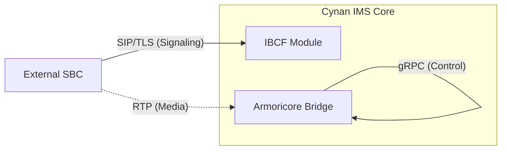

# SBC Connectivity Guide for Cynan IMS Core

This guide details how to integrate Session Border Controllers (SBCs) with the Cynan IMS Core. It covers both SIP signaling interworking via the **IBCF** (Interconnection Border Control Function) and secure media control via the **Armoricore** interface.

**Target Audience**: Network Engineers, SBC Vendors, Security Architects.

---

## 1. Connectivity Overview

The Cynan IMS Core exposes two primary interfaces for SBC interaction:

| Interface | Protocol | Port (Default) | Purpose |
| :--- | :--- | :--- | :--- |
| **IBCF (SIP)** | SIP / TLS | 5061 | Inter-operator signaling, trusted peer interconnection, topology hiding. |
| **Armoricore** | gRPC / TLS | 50051 | Media session control, RTP stream allocation, transcoding instructions. |



---

## 2. SIP Interconnection (IBCF)

The **IBCF** acts as the security gateway for all SIP traffic entering or leaving the IMS core from external networks.

### 2.1 Supported Standards
*   **Signaling**: SIP v2.0 (RFC 3261)
*   **Transport**: TLS 1.3 (Recommended), TCP, UDP
*   **Media**: SDP Offer/Answer (RFC 3264)

### 2.2 Configuration Requirements

To connect an SBC, it must be registered as a **Trusted Peer** in the Cynan configuration.

**`cynan.yaml` Configuration**:
```yaml
ibcf:
  enabled: true
  local_domain: "cynan.ims"
  
  trusted_peers:
    - domain: "sbc.partner.net"
      ip_addresses: ["203.0.113.10", "203.0.113.11"]
      trust_level: 100
      rate_limit: 500  # CPS
      require_pqc: true # Enforce Post-Quantum Signatures
      pqc_public_key: "base64_encoded_ml_dsa_65_public_key..."
```

### 2.3 Post-Quantum Security (PQC)

If `require_pqc: true` is enabled, the IMS Core will reject any requests that do not contain a valid **ML-DSA-65** signature.

**Required Header**: `X-PQC-Signature`

**Signature Construction**:
1.  **Payload**: `method || uri || call_id || cseq`
2.  **Algorithm**: ML-DSA-65 (FIPS 204)
3.  **Encoding**: Raw bytes

**Example Flow**:
```http
INVITE sip:user@cynan.ims SIP/2.0
Via: SIP/2.0/TLS sbc.partner.net:5061;branch=z9hG4bK...
Call-ID: 12345@sbc.partner.net
CSeq: 1 INVITE
X-PQC-Signature: <3309 bytes of raw signature>
```

### 2.4 Topology Hiding

Incoming requests from the SBC will have their `Via`, `Record-Route`, and `Contact` headers rewritten to hide the internal topology of the Cynan IMS Core.

*   **Internal**: `sip:scscf-1.internal:6060`
*   **External (To SBC)**: `sip:token@ibcf.external` (Encrypted token)

---

## 3. Media Control (Armoricore Bridge)

For deployments where Cynan controls the media plane directly (e.g., using Armoricore as the media engine), the Core uses gRPC to instruct the media server.

### 3.1 gRPC Interface
*   **Service**: `armoricore.media.MediaEngine`
*   **Methods**: `CreateStream`, `ModifyStream`, `StopStream`
*   **Security**: TLS 1.3 with optional PQC Key Exchange (ML-KEM-768)

### 3.2 Connectivity Configuration

Configure the bridge in `cynan.yaml`:
```yaml
armoricore:
  grpc_target: "https://media-engine.internal:50051"
  tls_enabled: true
  pqc_mode: "hybrid"  # Options: disabled, hybrid, pqc-only
  
  # TLS Certificates
  cert_path: "/etc/cynan/certs/client.pem"
  key_path: "/etc/cynan/certs/client-key.pem"
  ca_cert_path: "/etc/cynan/certs/ca.pem"
```

---

## 4. Troubleshooting Connection Issues

### Common Errors

**1. "403 Forbidden - Untrusted Peer"**
*   **Cause**: Source IP of the SBC does not match the `ip_addresses` list in `trusted_peers`.
*   **Fix**: Update `cynan.yaml` with the correct SBC egress IP.

**2. "428 Precondition Required - Missing PQC Signature"**
*   **Cause**: `require_pqc: true` is set, but the SBC is sending standard SIP without the `X-PQC-Signature` header.
*   **Fix**: Either disable PQC enforcement or upgrade SBC to sign requests.

**3. "gRPC Handshake Failed"**
*   **Cause**: TLS certificate mismatch or unsupported PQC mode.
*   **Fix**: Ensure the Armoricore server CA is in `ca_cert_path` and `pqc_mode` matches the server capabilities.
